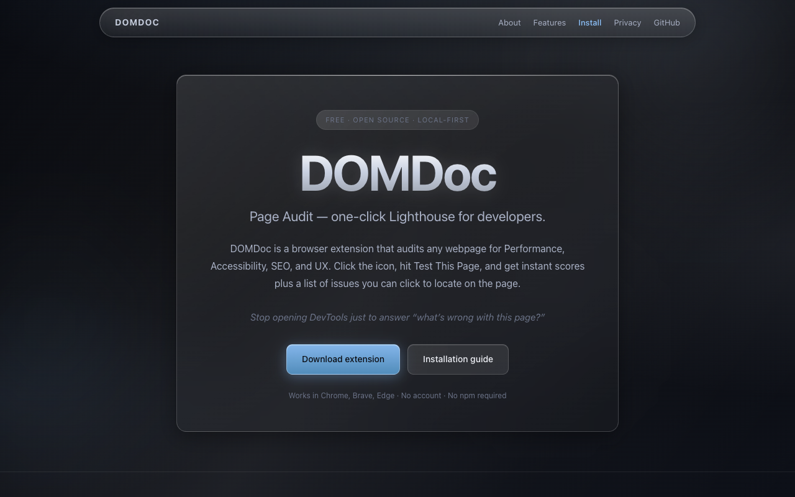
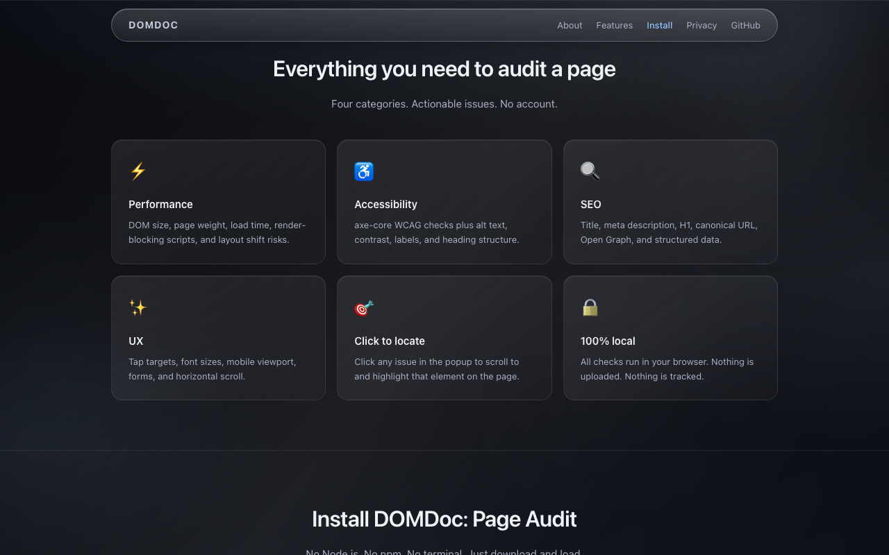
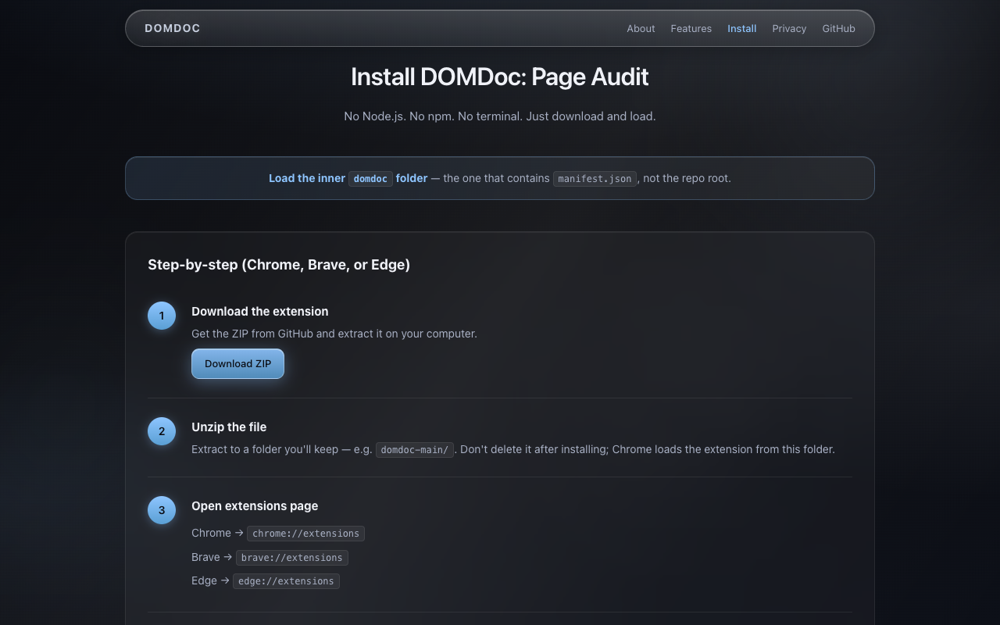
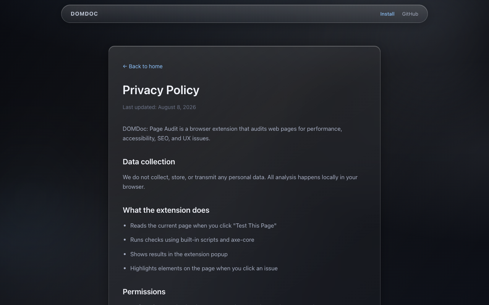

# DOMDoc: Page Audit

**DOMDoc** is a free, open-source Chrome extension that audits any webpage for **Performance**, **Accessibility**, **SEO**, and **UX** — one-click Lighthouse for developers.

🌐 **Website:** [shubhransh-gupta.github.io/domdoc](https://shubhransh-gupta.github.io/domdoc/)

## Website preview

<p align="center">
  
</p>

<p align="center">
  
</p>

<p align="center">
  
</p>

<p align="center">
  
</p>

## Quick install

1. [Download ZIP](https://github.com/shubhransh-gupta/domdoc/archive/refs/heads/main.zip)
2. Unzip and open the inner **`domdoc`** folder (contains `manifest.json`)
3. Go to `chrome://extensions` → enable **Developer mode** → **Load unpacked**
4. Select that folder, visit any site, click **Test This Page**

Works in Chrome, Brave, and Edge. No npm. No build step.

## Repository structure

```
domdoc/          ← Chrome extension (load this folder)
website/         ← Marketing site (GitHub Pages)
store/           ← Chrome Web Store listing copy
scripts/         ← Build scripts
```

## Features

- One-click scores for Performance, Accessibility, SEO, and UX
- axe-core WCAG accessibility checks (bundled)
- Click any issue to highlight the element on the page
- 100% local — nothing leaves your browser

## Links

- [Installation guide](https://shubhransh-gupta.github.io/domdoc/#install)
- [Privacy policy](https://shubhransh-gupta.github.io/domdoc/privacy.html)
- [Extension README](./domdoc/README.md)
- [Report a bug](https://github.com/shubhransh-gupta/domdoc/issues)

## License

[MIT](./LICENSE) © 2026 Shubhransh Gupta
